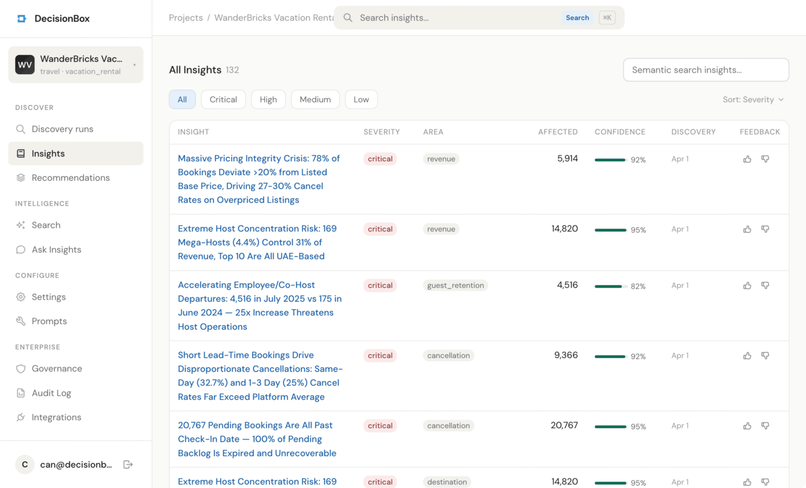

<p align="center">
  <a href="https://decisionbox.io"></a>
</p>

<p align="center">
  <a href="LICENSE"></a>
  <a href="https://golang.org"></a>
  <a href="https://github.com/decisionbox-io/decisionbox-platform/actions/workflows/ci.yml"></a>
  <a href="https://github.com/decisionbox-io/decisionbox-platform/actions/workflows/docker-publish.yml"></a>
  <a href="https://codecov.io/gh/decisionbox-io/decisionbox-platform"></a>
  <a href="https://github.com/decisionbox-io/decisionbox-platform/releases/latest"></a>
  <a href="https://github.com/decisionbox-io/decisionbox-platform/issues"></a>
  <a href="CONTRIBUTING.md"></a>
  <a href="https://decisionbox.io/docs"></a>
</p>

**Autonomous AI data discovery on your data warehouse.** DecisionBox connects to your warehouse, runs an agent that decides what to investigate, writes and executes SQL, and ships validated insights and ranked recommendations — without you asking a single question.

Built for any team that makes decisions on data. Every finding is re-queried against your warehouse before it reaches you. Every SQL query, reasoning step, and decision logged and visible.

<p align="center">
  
</p>

## Why DecisionBox

- **Autonomous, not a copilot.** The agent picks what to investigate. 50–100+ SQL queries per discovery run, unattended.
- **Every number re-queried.** Independent verification queries confirm each claim against your warehouse before it ships. Nothing hallucinated, nothing unchecked.
- **Full transparency.** Every SQL query, every reasoning step, every decision logged and visible. Audit the agent the way you'd review an analyst.
- **Your infra, your data.** Open source, AGPL v3, self-hostable. Works with any major warehouse and any LLM — including local models via Ollama.
- **Tuned to your industry.** Swap or author domain packs without touching core code. E-commerce, social, and gaming shipped; bring your own for anything else.

## How It Works

```
Your Data Warehouse             DecisionBox Agent            Dashboard
(BigQuery, Redshift,      →    (AI explores your data)  →   (Insights & Recommendations)
 Snowflake, PostgreSQL,
 Databricks, MSSQL)
                                 writes SQL, validates
                                 findings, generates
                                 actionable advice
```

1. **Connect** your data warehouse (BigQuery, Redshift, Snowflake, PostgreSQL, Databricks, Microsoft SQL Server)
2. **Configure** your project (domain pack, profile, LLM provider)
3. **Run discovery** — the AI agent autonomously explores your data
4. **Review insights** — severity-ranked findings with confidence scores
5. **Act on recommendations** — specific, numbered action steps

## Features

### Discovery
- **Autonomous agent loop** — AI writes and executes SQL, iterates on results, and produces insights + ranked recommendations without prompts or questions
- **Insight validation** — Independent verification queries re-check every claim against your warehouse before it ships
- **Live progress** — Watch the agent explore in real time with phase tracking, step details, and expandable SQL
- **Cost estimation** — Estimate LLM tokens + warehouse query costs before running
- **Selective discovery** — Run specific analysis areas on demand
- **Feedback loop** — Like/dislike insights and recommendations; the agent learns from feedback on the next run

### Search & Ask
- **Semantic search** — Vector search over insights and recommendations (Qdrant + HNSW), with cross-project scope
- **Ask Insights** — RAG-powered Q&A across your discoveries with citations, multi-turn sessions, and 90-day search history
- **Spotlight (Cmd+K)** — Fast navigation and search across projects from anywhere in the dashboard
- **Knowledge sources hook** — Plug in your own retrieval (docs, runbooks, policies) to enrich exploration, analysis, and /ask prompts

### Reading UX
- **Bookmark lists** — Save insights and recommendations into named lists with inline notes
- **Read tracking** — Per-user read state across devices, with reduced-opacity rows and "mark unread" action
- **Technical details toggle** — SQL queries and exploration steps collapsed by default; one click to reveal the engine internals
- **Related items sidebar** — Sticky right-column TOC with related recommendations, related insights, and semantic matches
- **Recommendation ↔ insight cross-linking** — Every recommendation carries the insight IDs it's grounded in

### Domain Packs
- **Built-in packs** — E-commerce, social, and gaming. Each domain ships with sub-categories so the agent's analysis areas, prompts, and profile schema match how a specific kind of product actually behaves — e-commerce, for example, covers many sub-categories because a fashion marketplace, a grocery store, and a digital-goods shop have fundamentally different funnels, retention curves, and margin structures, and a single generic "e-commerce" prompt would miss what matters for each. Gaming, similarly, covers match-3, idle/incremental, and casual/hyper-casual. New packs — SaaS, fintech, content/media, education, health, and more — ship weekly.
- **Dynamic packs** — Create, edit, import, and export packs from the dashboard (stored in MongoDB, no code changes)
- **Portable JSON format** — Share packs across projects and environments
- **System-test pack** — Diagnostic pack (env-gated) for validating warehouse connectivity and type mapping

### Warehouses
- **BigQuery** — ADC or Service Account Key, with dry-run cost estimation
- **Redshift** — Serverless + provisioned; IAM Role, Access Keys, or Assume Role with external ID for cross-account
- **Snowflake** — Username/password or Key Pair (JWT)
- **PostgreSQL** — Username/password or connection string, SSL configurable
- **Databricks** — Unity Catalog via Personal Access Token or OAuth M2M (service principal)
- **Microsoft SQL Server** — SQL Server 2016+ and Azure SQL Database, SQL login or full connection string
- **Read-only enforcement + schema-aware SQL self-heal** — Each provider ships a tuned SQL-fix prompt for its dialect
- **More warehouses ship weekly** — request one on [GitHub Issues](https://github.com/decisionbox-io/decisionbox-platform/issues) to fast-track it

### LLM Providers
Claude (direct API), OpenAI, Ollama (local), Vertex AI (Claude + Gemini on GCP), AWS Bedrock, Azure AI Foundry. Per-project configuration; editable prompts; per-model max output token limits.

### Embedding Providers
OpenAI, Vertex AI, Bedrock, Azure OpenAI, Voyage AI, Ollama. Used for insight/recommendation embeddings, semantic search, and /ask.

### Secrets
Per-project credentials, encrypted. MongoDB (AES-256-GCM default), GCP Secret Manager, AWS Secrets Manager, Azure Key Vault.

### Notifications
Webhook notifications on discovery completion: Slack, generic HTTP, or email — configurable per-project with templated payloads.

### Deployment
- **Docker Compose** for local dev and single-server installs
- **Helm charts** (API + Dashboard + optional MongoDB + Qdrant subcharts); public chart repo at `https://decisionbox-io.github.io/decisionbox-platform`
- **Terraform modules** for GCP (GKE), AWS (EKS), and Azure (AKS), with Workload Identity / IRSA wiring
- **Interactive setup wizard** (`terraform/setup.sh`) for GCP, AWS, or Azure with auth, resume, and destroy support
- **Optional IP allowlist** for GKE / EKS / AKS control-plane and dashboard ingress
- **Multi-arch Docker images** (linux/amd64 + linux/arm64)

### Extensibility
- **Plugin architecture** — providers register via `init()` + `RegisterWithMeta()`
- **Warehouse middleware** (`warehouse.RegisterMiddleware()`) — wrap providers with logging, metrics, or access controls
- **HTTP middleware** (`apiserver.RegisterGlobalMiddleware()`) — wrap all API requests (audit logging, custom auth)
- **Custom builds** via `apiserver.Run()` / `agentserver.Run()` with blank imports

## Use Cases

DecisionBox works with any queryable data. Point it at your data source and it discovers insights specific to your domain.

**E-commerce** — _"Cart abandonment spikes 40% when shipping cost exceeds 8% of cart value. Free shipping threshold at $75 would recover an estimated 1,200 orders/month."_

**SaaS** — _"Teams that don't use the dashboard feature within 14 days of signup have 3x higher churn. An onboarding email on Day 3 highlighting dashboards could improve activation."_

**Fraud Detection** — _"Accounts created in the last 48 hours with 5+ high-value transactions account for 82% of chargebacks. Flagging this pattern would prevent $34K/month in losses."_

**Social Network** — _"Posts published between 6–8 PM with images get 3.2x more shares, but only 12% of creators post during this window. A scheduling nudge could boost platform-wide engagement."_

**SQL Performance** — _"The top 10 slowest queries consume 62% of warehouse compute. 7 of them scan full tables where a partition filter would reduce cost by ~$4,800/month."_

**Gaming** — _"Players who fail level 12 more than 3 times have 68% higher Day-7 churn. Consider adding a hint system or difficulty adjustment at this stage."_

These are examples — create a [domain pack](https://decisionbox.io/docs/guides/creating-domain-packs) for any industry and DecisionBox adapts its analysis accordingly.

## Quick Start

**Prerequisites:** Docker and Docker Compose

```bash
# Clone the repository
git clone https://github.com/decisionbox-io/decisionbox-platform.git
cd decisionbox-platform

# Start MongoDB + Qdrant + API + Dashboard
docker compose up -d

# Open the dashboard
open http://localhost:3000
```

The dashboard will guide you through creating your first project. You'll need:
- A data warehouse connection (BigQuery project ID, Redshift workgroup, Snowflake account, PostgreSQL host, Databricks workspace, or SQL Server host)
- An LLM API key (Anthropic, OpenAI, or configure Vertex AI / Bedrock / Azure AI Foundry)

For detailed setup instructions, see the [Installation Guide](https://decisionbox.io/docs/getting-started/installation).

## Deployment

| Method | Use case | Guide |
|--------|----------|-------|
| **Docker Compose** | Local dev, single server | [Docker](https://decisionbox.io/docs/deployment/docker) |
| **Kubernetes (Helm)** | Production on any K8s cluster | [Kubernetes](https://decisionbox.io/docs/deployment/kubernetes) |
| **Terraform (GCP)** | Automated GKE provisioning | [Terraform GCP](https://decisionbox.io/docs/deployment/terraform-gcp) |
| **Terraform (AWS)** | Automated EKS provisioning | [Terraform AWS](https://decisionbox.io/docs/deployment/terraform-aws) |
| **Terraform (Azure)** | Automated AKS provisioning | [Terraform Azure](https://decisionbox.io/docs/deployment/terraform-azure) |
| **Setup Wizard** | One-command GKE/EKS/AKS + Helm deploy | [Setup Wizard](https://decisionbox.io/docs/deployment/setup-wizard) |

Resources: [Helm charts](helm-charts/) | [Terraform modules](terraform/) | [Helm values reference](https://decisionbox.io/docs/reference/helm-values)

## Development

**Run locally without Docker** (recommended for development):

```bash
# Start MongoDB + Qdrant only
docker compose up -d mongodb qdrant

# Terminal 1: Run the API
make dev-api

# Terminal 2: Run the Dashboard
make dev-dashboard

# Open http://localhost:3000
```

**Build binaries:**

```bash
make build              # Build agent + API binaries
make build-dashboard    # Build dashboard
```

**Run tests:**

```bash
make test               # All tests (Go + UI)
make test-go            # Go unit tests only
make test-integration   # Integration tests (needs Docker)
make test-llm           # LLM provider tests (needs API keys)
```

## Extending DecisionBox

DecisionBox is built on a plugin architecture. You can add:

### Domain Packs

Domain packs define how the AI analyzes data for a specific industry. A domain pack includes:
- Analysis areas (what to look for)
- Prompt templates (how the AI reasons)
- Profile schemas (what context users provide)

Domain packs are stored in MongoDB and managed from the dashboard. Built-in packs (e-commerce, social, gaming) are seeded on first startup. Create your own from the dashboard or import a portable JSON file — no code changes needed.

See [Creating Domain Packs](https://decisionbox.io/docs/guides/creating-domain-packs).

### LLM Providers

Add support for any LLM by implementing the `llm.Provider` interface (one method: `Chat`).

See [Adding LLM Providers](https://decisionbox.io/docs/guides/adding-llm-providers).

### Warehouse Providers

Add support for any SQL warehouse by implementing the `warehouse.Provider` interface.

See [Adding Warehouse Providers](https://decisionbox.io/docs/guides/adding-warehouse-providers).

### Middleware Hooks

Wrap warehouse providers or HTTP handlers with custom logic using the middleware registration system:

- **Warehouse middleware** — `warehouse.RegisterMiddleware()` wraps the warehouse provider (e.g., query logging, access controls, cost tracking)
- **HTTP middleware** — `apiserver.RegisterGlobalMiddleware()` wraps all API requests (e.g., audit logging, custom auth)
- **Custom agent builds** — Import `agentserver.Run()` and register middleware via `init()` blank imports

## Configuration

Key environment variables:

| Variable | Default | Description |
|----------|---------|-------------|
| `MONGODB_URI` | (required) | MongoDB connection string |
| `MONGODB_DB` | `decisionbox` | Database name |
| `QDRANT_URL` | `http://qdrant:6334` | Qdrant endpoint for vector search |
| `SECRET_PROVIDER` | `mongodb` | Secret storage: `mongodb`, `gcp`, `aws`, `azure` |
| `RUNNER_MODE` | `subprocess` | Agent runner: `subprocess`, `kubernetes` |
| `LLM_TIMEOUT` | `300s` | Timeout per LLM API call |
| `TELEMETRY_ENABLED` | `true` | Anonymous usage telemetry ([details](TELEMETRY.md)) |

Full reference: [Configuration](https://decisionbox.io/docs/reference/configuration).

## Telemetry

DecisionBox collects anonymous usage telemetry to help improve the product. No PII, query content, or credentials are ever collected. Disable with `TELEMETRY_ENABLED=false` or `DO_NOT_TRACK=1`. See [TELEMETRY.md](TELEMETRY.md) for full details.

## Documentation

**[decisionbox.io/docs](https://decisionbox.io/docs/)** — Full documentation including:

- [Quick Start](https://decisionbox.io/docs/getting-started/quickstart)
- [Installation Guide](https://decisionbox.io/docs/getting-started/installation)
- [Architecture](https://decisionbox.io/docs/concepts/architecture)
- [Providers](https://decisionbox.io/docs/concepts/providers)
- [Domain Packs](https://decisionbox.io/docs/concepts/domain-packs)
- [API Reference](https://decisionbox.io/docs/reference/api)
- [Configuration Reference](https://decisionbox.io/docs/reference/configuration)
- [Contributing](https://decisionbox.io/docs/contributing/development)

## Tech Stack

| Component | Technology |
|-----------|-----------|
| Agent | Go 1.25 |
| API | Go 1.25, net/http (stdlib) |
| Dashboard | Next.js 16, React 19, TypeScript, Mantine 8 |
| Database | MongoDB |
| Vector store | Qdrant (HNSW) |
| Warehouses | BigQuery, Redshift, Snowflake, PostgreSQL, Databricks, Microsoft SQL Server |
| LLM providers | Claude, OpenAI, Ollama, Vertex AI, Bedrock, Azure AI Foundry |
| Embedding providers | OpenAI, Vertex AI, Bedrock, Azure OpenAI, Voyage AI, Ollama |
| Secret providers | MongoDB (AES-256-GCM), GCP Secret Manager, AWS Secrets Manager, Azure Key Vault |
| CI/CD | GitHub Actions, GHCR |
| Deployment | Docker Compose, Kubernetes (Helm), Terraform (GCP, AWS, Azure) |

## Contributing

We welcome contributions. See [Contributing Guide](https://decisionbox.io/docs/contributing/development) for development setup, testing, and PR process.

## Community

- [GitHub Issues](https://github.com/decisionbox-io/decisionbox-platform/issues) — Bug reports, feature requests
- [GitHub Discussions](https://github.com/decisionbox-io/decisionbox-platform/discussions) — Questions, ideas

## Roadmap

See the full roadmap on the [project board](https://github.com/orgs/decisionbox-io/projects/4/views/3).
